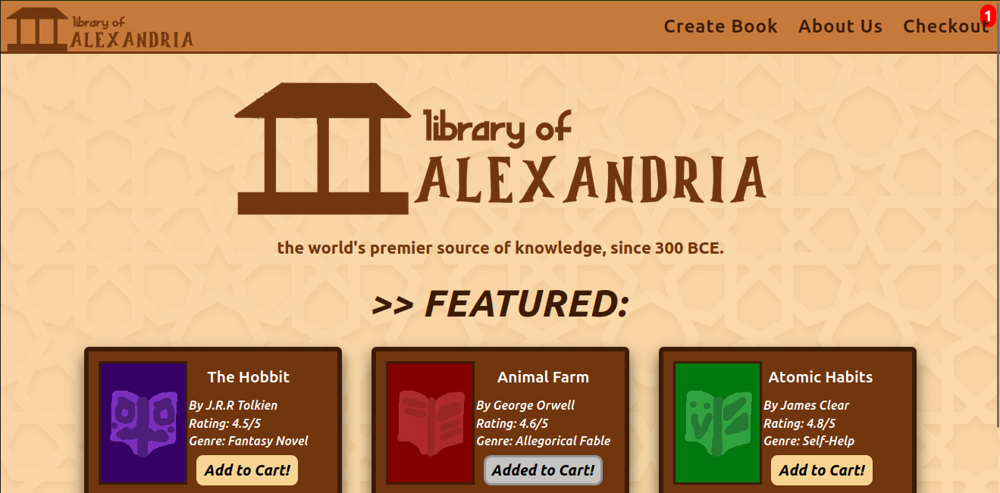

# See It Live:
https://novabrix.github.io/library-of-alexandria/ 

PROJECT-LIBRARY is a dummy library app that displays proficiency in OOP and intermediate JS. Created by Idriis Yusuf (novabrix) on 6/2025.
